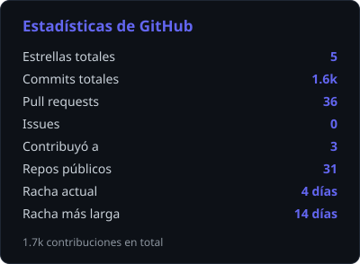
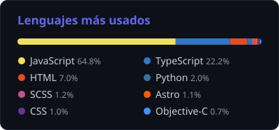

<div align="center">


# 👋 Hola, soy Anthoni Rivera

**Fullstack Developer · Mobile UI & UX Designer · Perú 🇵🇪**

<p>
  <a href="https://www.linkedin.com/in/anthoniriv01/"></a>
  <a href="https://x.com/anthoniriv01"></a>
  <a href="https://instagram.com/anthoniriv01"></a>
  <a href="mailto:anthoniriv01@gmail.com"></a>
</p>

</div>

---

### 🚀 Sobre mí

```ts
const anthoni = {
  ubicacion:   "Perú 🇵🇪",
  rol:         "Fullstack Developer",
  enfoque:     ["Frontend", "Mobile UI", "UX Design"],
  aprendiendo: ["React", "Ionic"],
  colaborando: "abierto a nuevos proyectos",
  extra:       "subo videos de tecnología en YouTube (español)",
};
```

- 🔭 Trabajando en **mantenerme más enfocado**
- 🌱 Aprendiendo **Ionic y React**
- 👯 Buscando **colaborar en proyectos nuevos**
- 📫 Contáctame: **anthoniriv01@gmail.com**

---

### 🛠️ Stack

<div align="center">


</div>

---

### 📊 Estadísticas

<div align="center">




<sub>Generadas a diario por <a href="./.github/workflows/stats.yml">GitHub Actions</a> — sin servicios de terceros.</sub>

</div>

---

### 📌 Proyectos destacados

#### [🗳️ versus-electoral-pe](https://github.com/anthoniriv/versus-electoral-pe) · [versuselectoral.com](https://www.versuselectoral.com/)

> _Agregá acá una descripción de una línea._


#### [📝 noteschain-web](https://github.com/anthoniriv/noteschain-web)

> _Agregá acá una descripción de una línea._


---

<div align="center">


*⭐️ Si algo de acá te sirve, déjale una estrella*

</div>
